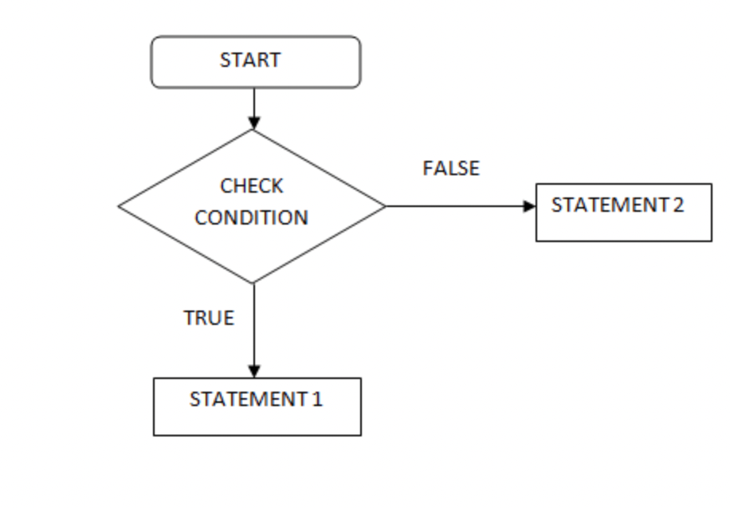

 
## Python Notes
 
### Variables
Variables act as containers for data such as strings of text or numbers that are created by simply assigning values to them, since a variables type is not declared asigning a new datatype to it will change its type.

Some Example variable declarations:

| Variable Type | Example Declaration                |
|---------------|------------------------------------|
| Integer       | `integer_variable = 5`         |
| Float         | `float_variable = 5.0`             |
| String        | `string_variable = "Hello"`        |
| Boolean       | `boolean_variable = True`          |

### Collections
Collections are simply variables that store other variables.

| Variable Type | Example Declaration                | Features                                                                                                                                                                                                             |
|---------------|------------------------------------|----------------------------------------------------------------------------------------------------------------------------------------------------------------------------------------------------------------------|
| List          | `list_variable = [1, 2, 3]`        | Ordered, mutable collection of items. Allows duplicate elements. Supports indexing and slicing. Elements can be of different data types.                                                                             |
| Tuple         | `tuple_variable = (1, 2, 3)`       | Ordered, immutable collection of items. Allows duplicate elements. Supports indexing and slicing. Elements can be of different data types.                                                                           |
| Dictionary    | `dict_variable = {'key': 'value'}` | Unordered collection of key-value pairs.Keys must be unique and immutable. Values can be of any data type and are mutable. Supports fast lookup by key.                                                              |
| Set           | `set_variable = {1, 2, 3}`         | Unordered, mutable collection of unique items. Does not allow duplicate elements. Commonly used for membership testing and eliminating duplicates. Supports set operations like union, intersection, and difference. |

### Control Flow
Control flow refers to tools a programmer can use to create paths that a program can branch through.

| Control Flow Type | Example Declaration                                                                                      |
|-------------------|----------------------------------------------------------------------------------------------------------|
| If Statement      | `if condition:`     `# code to execute`                                                             |
| If-Else Statement | `if condition:`     `# code to execute`  `else:`     `# code to execute`                       |
| If-Elif-Else      | `if condition1:`     `# code to execute` `elif condition2:`     `# code to execute` `else:`     `# code to execute` |
| For Loop          | `for item in iterable:`     `# code to execute`                                                             |
| While Loop        | `while condition:`     `# code to execute`                                                                  |
| Break             | `break`                                                                                                  |
| Continue          | `continue`                                                                                               |
| Pass              | `pass`                                                                                                   |
| Try-Except        | `try:`     `# code that may raise exception`   `except ExceptionType:`     `# code to execute if exception occurs` 

 