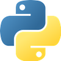

 
## Python Notes
 
### Variables
Variables act as containers for data such as strings of text or numbers that are created by simply assigning values to them, since a variables type is not declared asigning a new datatype to it will change its type.

Some Example variable eclarations:


| Variable Type | Example Declaration                |
|---------------|------------------------------------|
| Integer       | `integer_variable = 5`         |
| Float         | `float_variable = 5.0`             |
| String        | `string_variable = "Hello"`        |
| Boolean       | `boolean_variable = True`          |


### Collections
Collections are simply variables that store other variables

| Variable Type | Example Declaration                | Features                                                                                                                                                                                                             |
|---------------|------------------------------------|----------------------------------------------------------------------------------------------------------------------------------------------------------------------------------------------------------------------|
| List          | `list_variable = [1, 2, 3]`        | Ordered, mutable collection of items. Allows duplicate elements. Supports indexing and slicing. Elements can be of different data types.                                                                             |
| Tuple         | `tuple_variable = (1, 2, 3)`       | Ordered, immutable collection of items. Allows duplicate elements. Supports indexing and slicing. Elements can be of different data types.                                                                           |
| Dictionary    | `dict_variable = {'key': 'value'}` | Unordered collection of key-value pairs.Keys must be unique and immutable. Values can be of any data type and are mutable. Supports fast lookup by key.                                                              |
| Set           | `set_variable = {1, 2, 3}`         | Unordered, mutable collection of unique items. Does not allow duplicate elements. Commonly used for membership testing and eliminating duplicates. Supports set operations like union, intersection, and difference. |


### Control Flow
Control flow refers to tools a programmer can use to create paths that a program can branch through.


| Control Flow Type | Example Declaration                                                                                      |
|-------------------|----------------------------------------------------------------------------------------------------------|
| If Statement      | `if condition:`<br />    `# code to execute`                                                             |
| If-Else Statement | `if condition:`<br />    `# code to execute`<br /> `else:`<br />    `# code to execute`                       |
| If-Elif-Else      | `if condition1:`<br />    `# code to execute`<br />`elif condition2:`<br />    `# code to execute`<br />`else:`<br />    `# code to execute` |
| For Loop          | `for item in iterable:`<br />    `# code to execute`                                                             |
| While Loop        | `while condition:`<br />    `# code to execute`                                                                  |
| Break             | `break`                                                                                                  |
| Continue          | `continue`                                                                                               |
| Pass              | `pass`                                                                                                   |
| Try-Except        | `try:`<br />    `# code that may raise exception` <br /> `except ExceptionType:`<br />    `# code to execute if exception occurs` 

```
example list = list()

```